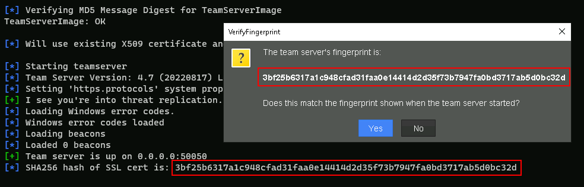

# CRTO Cheat Sheet

### **Command & Control**

**Starting the Team Server**

Go to the cobaltstrike folder

```bash
cd cobaltstrike/
```

Run teamserver

```bash
sudo ./teamserver <your-ip> <your-password> c2-profiles/normal/webbug.profile
```

### Connection Configuration in Cobalt Strike

**Alias:** Identifier name (anyone).  
**Host:** Server IP address or hostname (10.10.10.10).  
**Port:** Server port (e.g., 50050).  
**User:** Configured username (e.g., jondoe).  
**Password:** Password associated with the user.

Once the fields are completed, select Connect to initiate the connection.

When connecting to a team server for the first time, the client prompts to confirm the server's fingerprint, ensuring the connection isn't intercepted.



### **Running as a Service**

If you want to run cobaltstrike as a service follow these steps.

**Create the configuration file**

```bash
sudo vim /etc/systemd/system/teamserver.service
```

**File Content**

Paste the following content (adjust paths and parameters according to your environment):

```ini
[Unit]
Description=Cobalt Strike Team Server
After=network.target
StartLimitIntervalSec=0

[Service]
Type=simple
Restart=always
RestartSec=1
User=root
WorkingDirectory=/home/attacker/cobaltstrike
ExecStart=/home/attacker/cobaltstrike/teamserver <your-ip> <your-password> c2-profiles/normal/webbug.profile

[Install]
WantedBy=multi-user.target
```

**Reload systemd and Verify Status**

```bash
sudo systemctl daemon-reload
sudo systemctl status teamserver.service
```

**Start the Service**

```bash
sudo systemctl start teamserver.service
sudo systemctl status teamserver.service
```

**Enable Automatic Startup**

```bash
sudo systemctl enable teamserver.service
```

### **Listener Management**

**Create an HTTP Listener**

1. Go to `Cobalt Strike` → `Listeners` → `Add`.
2. Fill in the required fields:

   - **Payload**: `windows/beacon_http/reverse_http`.
   - **Host**: The public or internal IP address of your Cobalt Strike server (e.g., `10.10.10.10`).
   - **Port**: The port you want to use (e.g., `80`, `443`).

3. Click **Save** to create the listener.

**Create an SMB Listener**

1. Go to `Cobalt Strike` → `Listeners` → `Add`.
2. Configure the following fields:

   - **Payload**: `windows/beacon_smb/bind_pipe`.
   - **Pipe Name**: Enter a unique name for the SMB pipe (e.g., `beacon_pipe`).

3. Click **Save** to create the listener.

**Create a TCP Listener**

1. Go to `Cobalt Strike` → `Listeners` → `Add`.
2. Configure the following fields:

   - **Payload**: `windows/beacon_tcp/reverse_tcp`.
   - **Host**: The IP address where the listener will receive traffic (e.g., `10.10.10.10`).
   - **Port**: Specify a port (e.g., `4444`).

3. Click **Save** to create the listener.

**Create a DNS Listener**

1. Go to `Cobalt Strike` → `Listeners` → `Add`.
2. Configure the following fields:

   - **Payload**: `windows/beacon_dns/reverse_dns_txt`.
   - **Host**: Enter the domain or subdomain you control that points to your server (e.g., `beacon.example.com`).
   - **Port**: Typically `53`, the standard DNS port.

3. Click **Save** to create the listener.

### Load Payloads

Load payloads into `C:\Payloads`

1. Go to **Cobalt Strike** → `Attacks` → `Windows Executable (Stageless)`.
2. In the **Folder** field, specify the directory where the payloads will be saved, in this case `C:\Payloads`.

---
